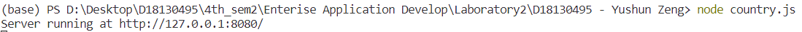
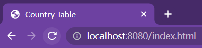
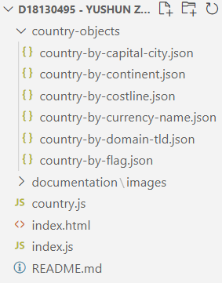
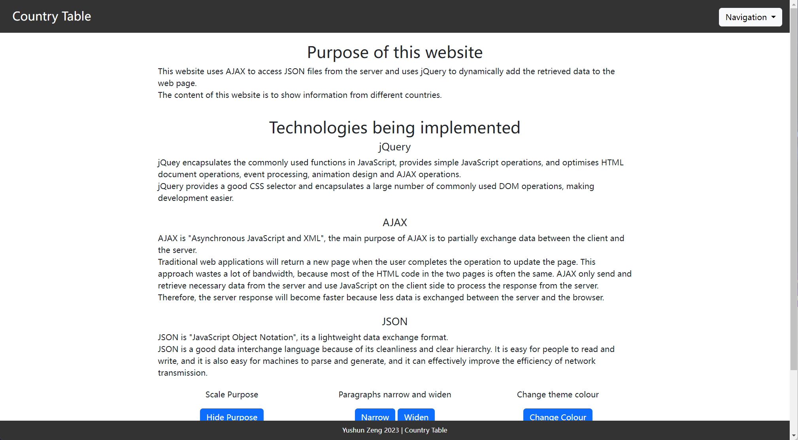
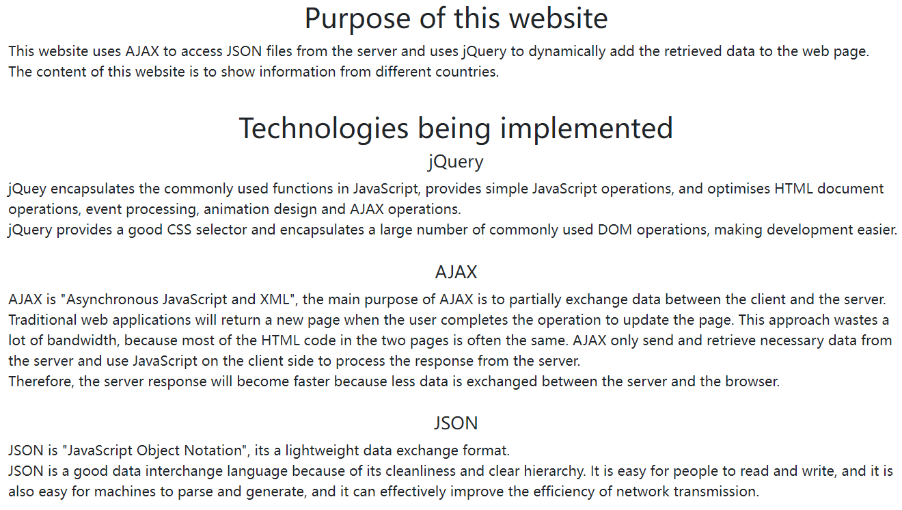
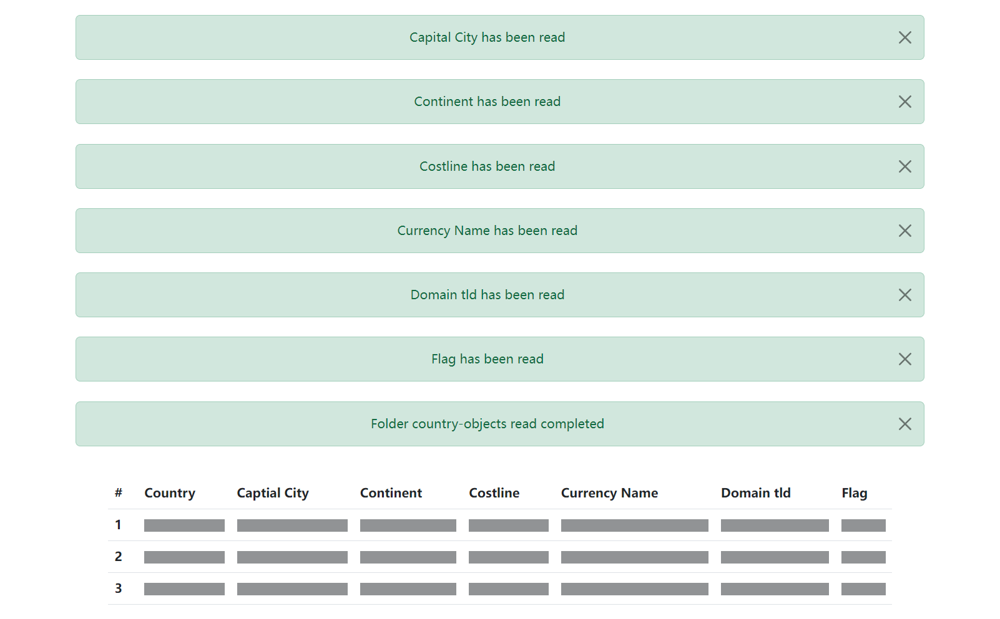
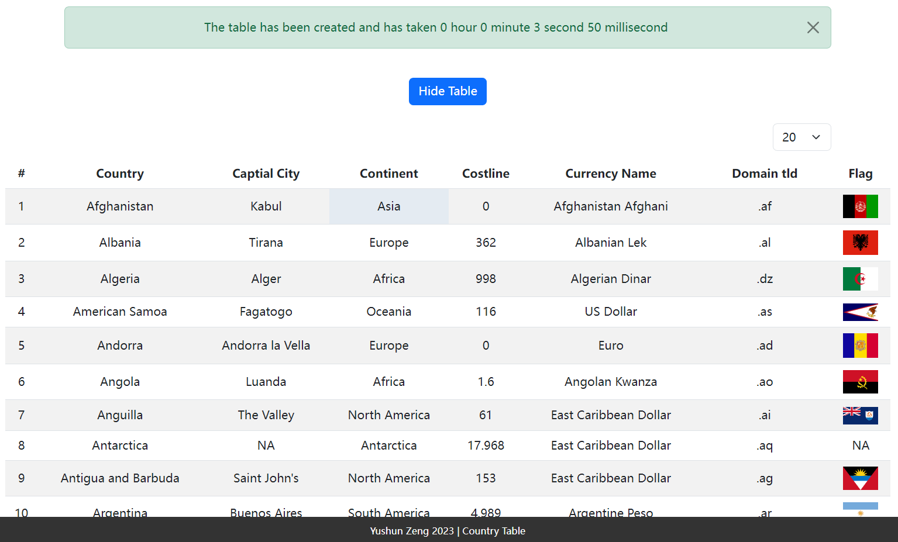
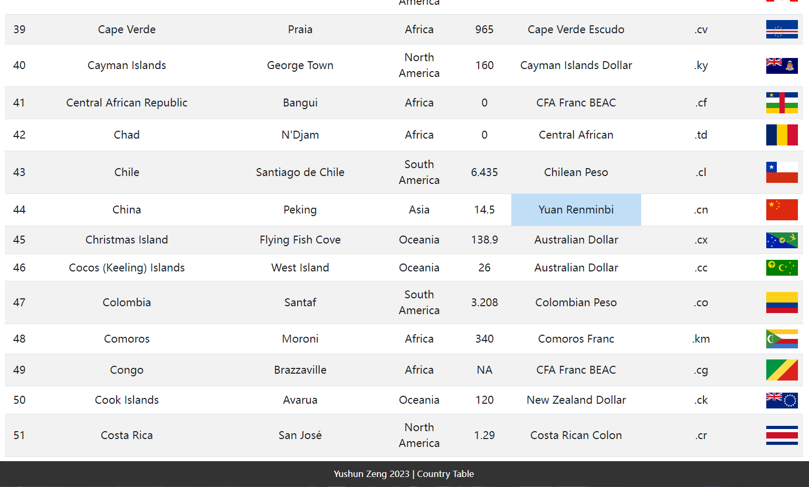

# Country Table

## Website Introduction
- [How to Open this Website](#how-to-open-this-website)
- [List the Parts that are Completed](#list-the-parts-that-are-completed)

## How to Open This Website:
To visit the website, download the folder and open in the Visual Studio Code.
 
Open the terminal to current path and execute "node country.js", the server will start at http://localhost:8080.

 
To visit the home page, go to the brower enter the URL: http://localhost:8080/index.html

 

## List the Parts that are Completed
1. Requirement 2 (create Node.js server with required structure)
    - Structure 
    

    
The structure of this project
 

    - load the index.html 
    

    
Main page
 

2. Requirement 3 (load country table)
    - explain the purpose of the program and technologies being implemented 
    

    
Purpose and technologies
 

    - load the table with file read notifications 
    

    
File read notification
 

    - table create time and change row display 
    

    
Table create time and change row display
 

3. Requirement 4 (jQuery effects)
    -
    -
    -
    -
    -
    -

4. Requirement 5 (select a specific cell of the table)
    - cell select and change colour 
    

    
cell select and change colour
 
