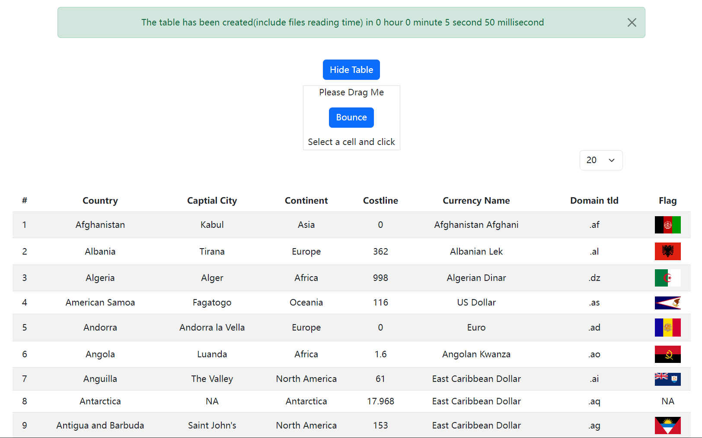
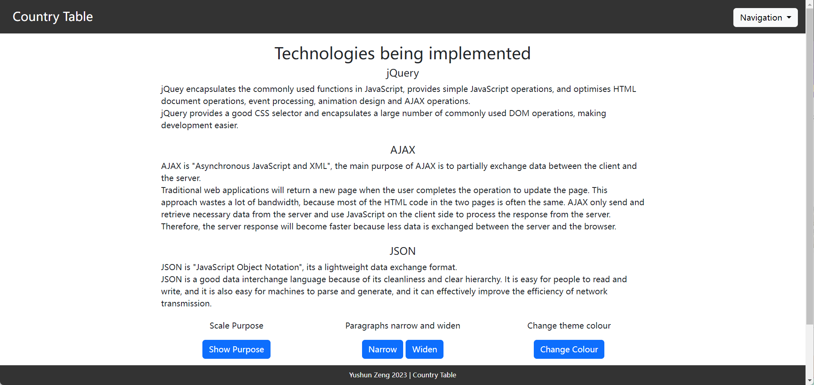
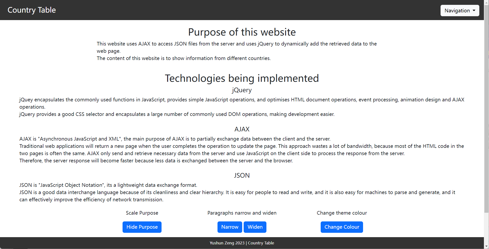
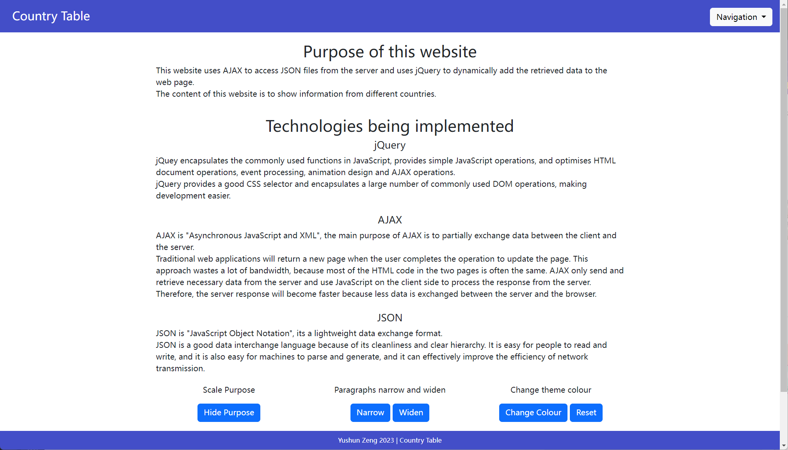
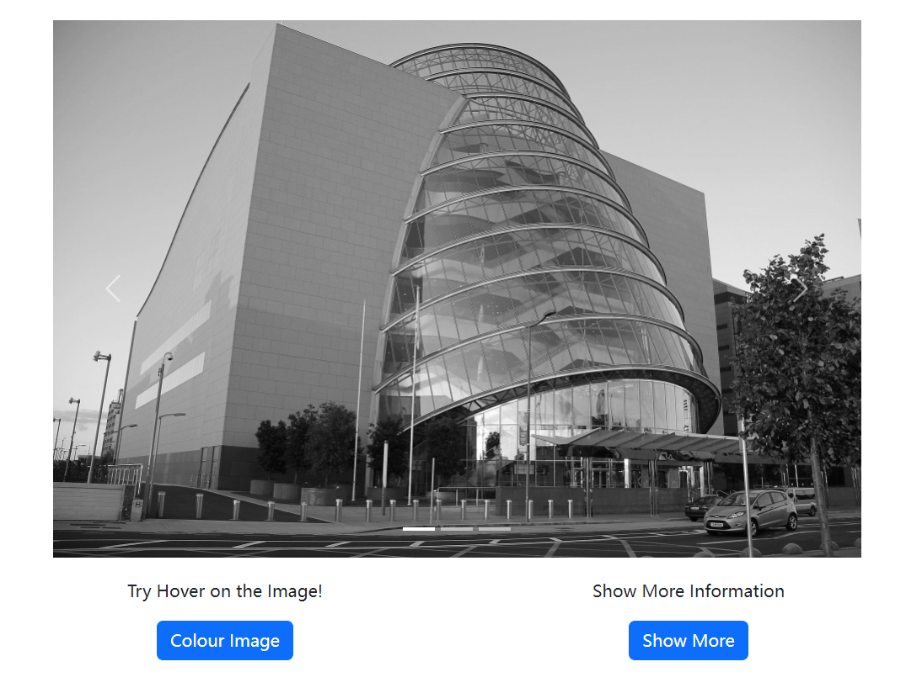
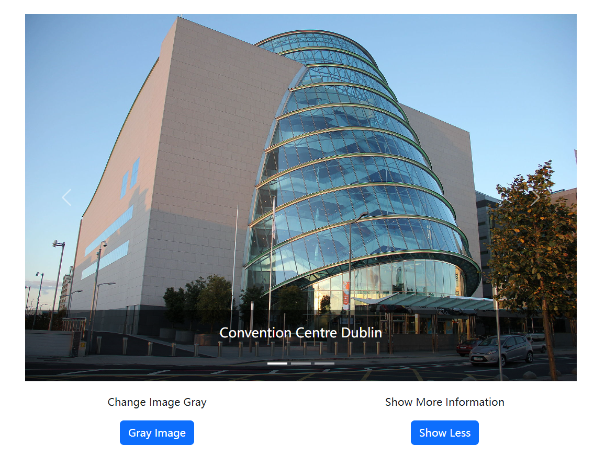
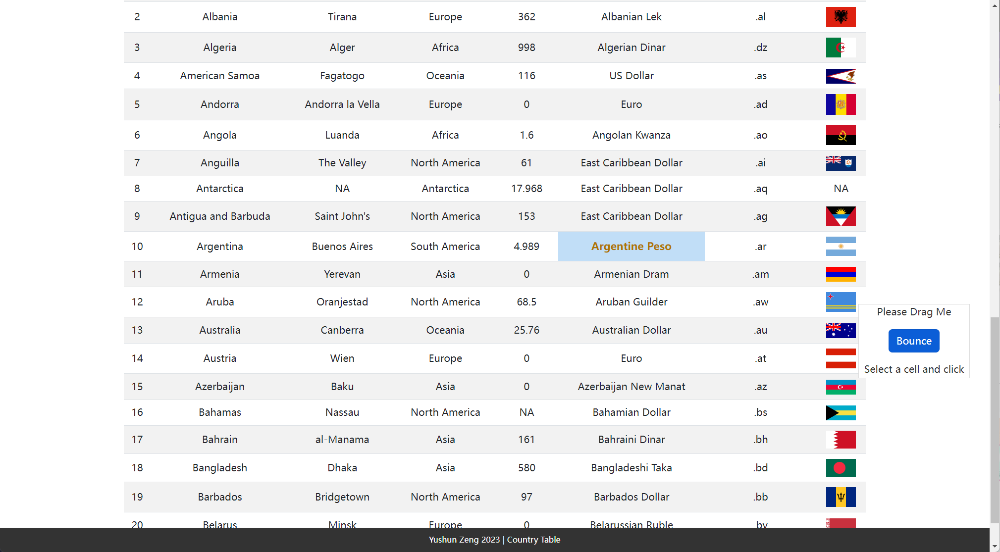

# Country Table

## Website Introduction
- [How to Open this Website](#how-to-open-this-website)
- [List the Parts that are Completed](#list-the-parts-that-are-completed)

## How to Open This Website:
To visit the website, download the folder and open in the Visual Studio Code or Terminal.
 
Open the terminal to current path and execute "node country.js", the server will start at http://localhost:8080.

 
To visit the home page, go to the brower enter the URL:
http://localhost:8080/index.html

 

## List the Parts that are Completed
1. Requirement 2 (create Node.js server with required structure)
    - Structure 
    

    
The structure of this project
 

    - load the index.html 
    

    
Main page
 

2. Requirement 3 (load country table)
    - explain the purpose of the program and technologies being implemented 
    

    
Purpose and technologies
 

    - load the table with file read notifications 
    

    
File read notification
 

    - table create time and change row display 
    

    
Table create time and change row display
 

3. Requirement 4 (jQuery effects)
    1. Scale to show and hide "purpose" section
         Purpose section can be shown or hidden
    

    
Hidden "purpose" section
 

    2. Narrow or Widen "paragraphs" section
         Paragraphs section can change the wide
    

    
Narrow the "paragraphs" section
 

    3. Change "header" and "footer" colour theme
         Header and Footer colour theme can be changed
    

    
Change "header" and "footer" colour theme
 

    4. Change image gray scale with hover
         Image can change grayscale
    

    
Image can change grayscale
 
    
    5. Zoom in the image and show more information
         Image can zoom in and display more information
    

    
Image display more information
 

    6. Drag button to zoom in, zoom out and change font style
         A button can be dragged wherever you want, and when you select a cell and click the button, the cell will zoom in and change style.
    

    
Zoom in and change font style
 

4. Requirement 5 (select a specific cell of the table)
    - cell select and change colour 
    

    
cell select and change colour
 